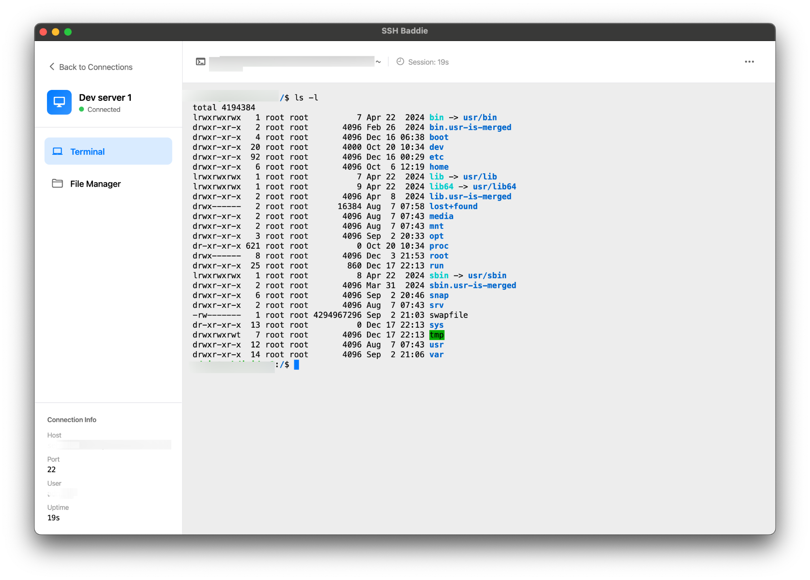
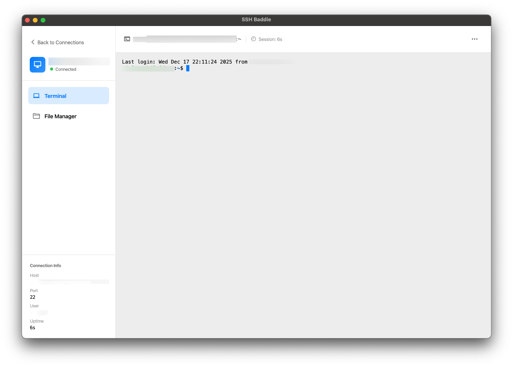
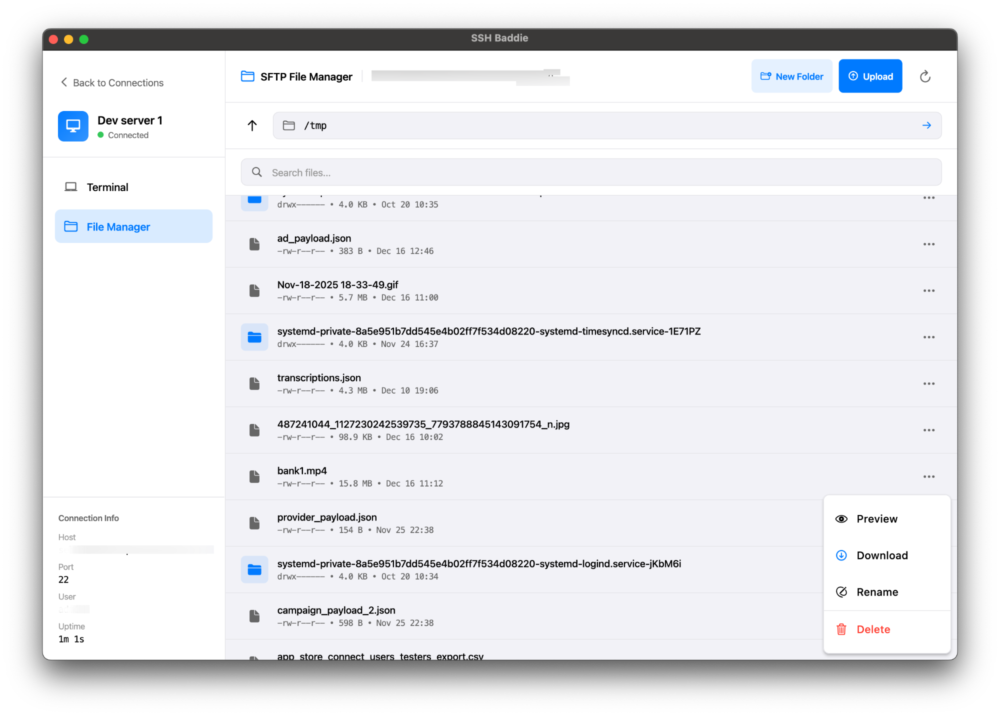

# SSH Baddie

A modern, native SSH client for macOS built with Flutter and Go. Features a beautiful terminal emulator with SFTP file management capabilities.


## Screenshots

<p align="center">
  
</p>

<p align="center">
  
</p>

<p align="center">
  
</p>

## Installation

### Quick Install (Recommended)

1. Download the latest DMG from [Releases](https://github.com/moolsbytheway/ssh-baddie/releases)
2. Open the DMG and drag **SSH Baddie** to your Applications folder
3. Launch the app from Applications

### Build from Source

See [Development Setup](#development-setup) below.

## Features

- **SSH Terminal** - Full-featured terminal emulator with xterm support
- **SFTP File Manager** - Browse, upload, download, and manage remote files
- **Connection Management** - Save and organize multiple SSH connections
- **Multiple Themes** - Dark, Light, Nord, Monokai, Gruvbox, Tokyo Night, and more
- **Universal Binary** - Native support for both Intel and Apple Silicon Macs

## Project Structure

```
ssh-baddie/
├── lib/                    # Flutter application code
│   └── ...
├── ssh-backend/            # Go backend server
│   └── ...
├── build.sh                # Build script
├── create_dmg.sh           # DMG packaging script
├── build_package.sh        # Full build + package script
└── pubspec.yaml
```

## Prerequisites

- **macOS** 12.0 or later
- **Flutter** 3.x ([Install Flutter](https://docs.flutter.dev/get-started/install/macos))
- **Go** 1.21+ ([Install Go](https://go.dev/dl/))
- **Xcode** with command line tools

## Development Setup

### 1. Clone the repository

```bash
git clone https://github.com/moolsbytheway/ssh-baddie.git
cd ssh-baddie
```

### 2. Install Flutter dependencies

```bash
flutter pub get
```

### 3. Build and run the Go backend

```bash
cd ssh-backend
go build -o build/ssh-backend .
./build/ssh-backend
```

The backend runs on `http://localhost:8822` by default.

#### Specifying a Custom Port

You can specify a custom port using the `-port` flag:

```bash
./build/ssh-backend -port 9000
```

### 4. Run the Flutter app

In a separate terminal:

```bash
flutter run -d macos
```

#### Backend Port Configuration

The Flutter app automatically discovers the backend port using the following priority:

1. **Environment variable** - Set `SSH_BACKEND_PORT` to specify a custom port
2. **Port file** - Reads from `~/.ssh_baddie_port` if it exists
3. **Default port** - Falls back to `8822`

**Using environment variable:**
```bash
SSH_BACKEND_PORT=9000 flutter run -d macos
```

**Using port file:**
```bash
echo "9000" > ~/.ssh_baddie_port
flutter run -d macos
```

This is useful when running multiple instances or when port 8822 is already in use.

## Building for Release

### Quick Build (Recommended)

Build everything and create a DMG installer:

```bash
./build_package.sh
```

This runs both `build.sh` and `create_dmg.sh` in sequence.

### Step-by-Step Build

#### 1. Build the application

```bash
./build.sh
```

This script:
- Builds the Go backend for both Intel (amd64) and Apple Silicon (arm64)
- Creates a universal binary using `lipo`
- Builds the Flutter macOS app in release mode
- Bundles the backend into the app's Resources folder

#### 2. Create DMG installer

```bash
./create_dmg.sh
```

This creates a distributable DMG file named `SSH-Baddie-{version}.dmg` where the version is automatically extracted from `pubspec.yaml`.

### Manual Build

If you prefer to build manually:

```bash
# Build Go backend (universal binary)
cd ssh-backend
GOOS=darwin GOARCH=amd64 go build -o build/ssh-backend-amd64 .
GOOS=darwin GOARCH=arm64 go build -o build/ssh-backend-arm64 .
lipo -create build/ssh-backend-amd64 build/ssh-backend-arm64 -output build/ssh-backend
cd ..

# Build Flutter app
flutter build macos --release

# Bundle backend into app
cp ssh-backend/build/ssh-backend \
   "build/macos/Build/Products/Release/SSH Baddie.app/Contents/Resources/"
```

## Contributing

Contributions are welcome! Here's how to get started:

### Getting Started

1. Fork the repository
2. Create a feature branch: `git checkout -b feature/amazing-feature`
3. Make your changes
4. Test thoroughly on macOS
5. Commit your changes: `git commit -m 'Add amazing feature'`
6. Push to the branch: `git push origin feature/amazing-feature`
7. Open a Pull Request

### Code Style

**Flutter/Dart:**
- Follow the [Dart style guide](https://dart.dev/guides/language/effective-dart/style)
- Run `flutter analyze` before committing
- Format code with `dart format .`

**Go:**
- Follow standard Go conventions
- Run `go fmt` and `go vet` before committing
- Ensure `go build` succeeds without warnings

### Areas for Contribution

- **New themes** - Add more terminal color schemes
- **SSH features** - Key management, port forwarding, jump hosts
- **File manager** - Drag-and-drop, batch operations
- **Performance** - Terminal rendering, large file transfers
- **Documentation** - Improve docs, add tutorials
- **Bug fixes** - Check the issues tab

### Reporting Issues

When reporting bugs, please include:
- macOS version
- Intel or Apple Silicon
- Steps to reproduce
- Expected vs actual behavior
- Relevant logs or screenshots

## Architecture

### Flutter App

The Flutter frontend handles all UI rendering and user interaction. It communicates with the Go backend via HTTP REST API and WebSocket connections.

Key components:
- `WorkspaceScreen` - Terminal and file manager views
- `ConnectionProvider` - Manages saved connections
- `ThemeProvider` - Handles app theming
- `BackendService` - Locates and communicates with the backend

### Go Backend

The Go backend handles SSH connections and SFTP operations. It exposes:
- `POST /api/ssh/connect` - Establish SSH connection
- `WS /api/terminal/{session_id}` - WebSocket for terminal I/O
- `GET/POST /api/sftp/*` - SFTP file operations

The backend is bundled inside the app bundle at `Contents/Resources/ssh-backend` and launched automatically when the app starts.

#### Port Selection

When launched by the app, the backend automatically finds an available port and writes it to `~/.ssh_baddie_port`. The Flutter app reads this file to discover the backend URL.

For manual/development usage:
```bash
# Use default port 8822
./ssh-backend

# Use custom port
./ssh-backend -port 9000
```

## License

Apache-2.0 License - see [LICENSE](LICENSE) for details.

## Roadmap

- [ ] **Windows support** - Build and package for Windows
- [ ] **Linux support** - Build and package for Linux (AppImage, deb, rpm)
- [ ] SSH key management
- [ ] Port forwarding
- [ ] Jump host / bastion support
- [ ] Session logging

The app is built with Flutter and Go, making cross-platform support straightforward. Contributions for Windows and Linux builds are welcome!

## Acknowledgments

- [xterm](https://pub.dev/packages/xterm) - Terminal emulator for Flutter
- [golang.org/x/crypto/ssh](https://pkg.go.dev/golang.org/x/crypto/ssh) - Go SSH library
- [pkg/sftp](https://github.com/pkg/sftp) - Go SFTP library